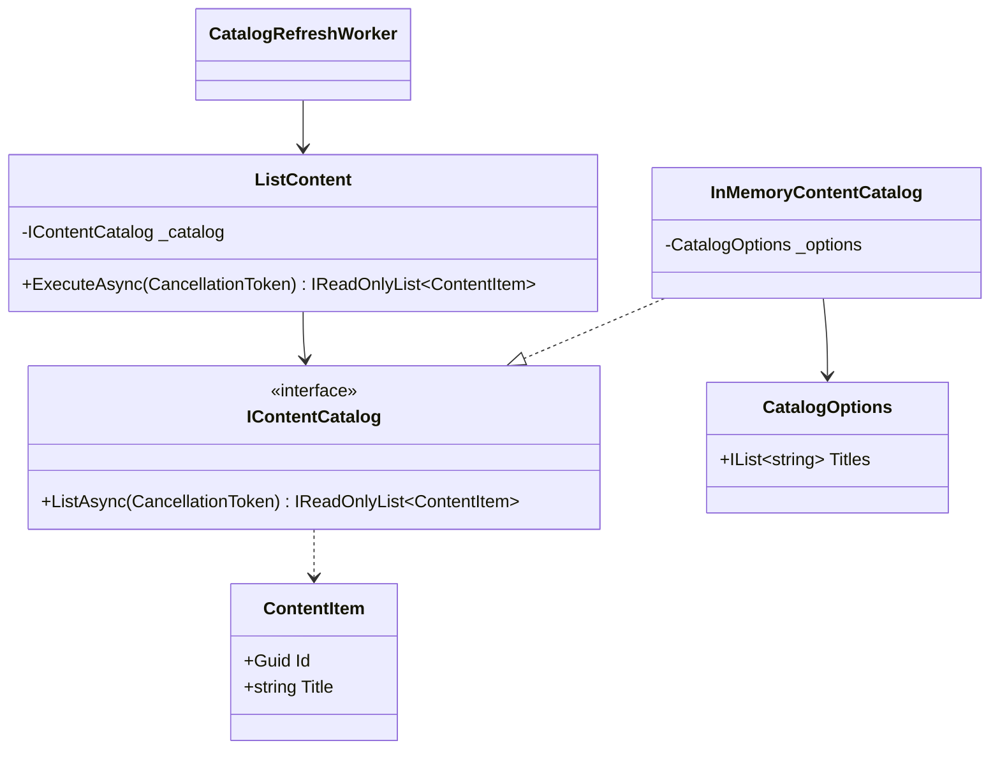

# Diagramas de clases

```mermaid
classDiagram
    class ContentItem {
        +Guid Id
        +string Title
    }
    class IContentCatalog {
        <<interface>>
        +ListAsync(CancellationToken) IReadOnlyList~ContentItem~
    }
    class ListContent {
        -IContentCatalog _catalog
        +ExecuteAsync(CancellationToken) IReadOnlyList~ContentItem~
    }
    class CatalogOptions {
        +IList~string~ Titles
    }
    class InMemoryContentCatalog {
        -CatalogOptions _options
    }
    class CatalogRefreshWorker
    ListContent --> IContentCatalog
    IContentCatalog ..> ContentItem
    InMemoryContentCatalog ..|> IContentCatalog
    InMemoryContentCatalog --> CatalogOptions
    CatalogRefreshWorker --> ListContent
```
